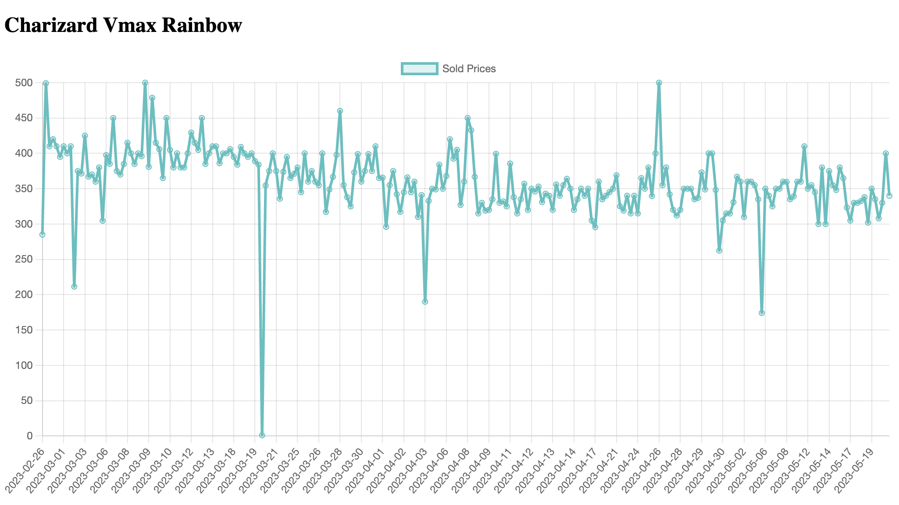

#Python data scrapper

 The python_webscraper is a tool designed to scrape sales data for specific cards from eBay. It utilizes the BeautifulSoup library to extract the necessary information. Once the data is retrieved, the tool performs several cleaning operations. It removes unwanted objects based on non-matching titles, cleans and formats the sold dates into Datetime format, and converts the sold prices into integers for easier manipulation and analysis.

 Once we have obtained the desired clean data, we save it into a JSON file for storage and future reference. This JSON file serves as the data source for generating a chart in the index.html file. We use the Chart.js library to create the chart, which visually maps all the card sales based on the collected data. This chart provides a graphical representation of the sales trends and patterns for the cards.

 to run in, install  beautifulSoup, assumming you already have python and pip.
 clone the repo to your computer:

    git clone //repo url//

and ones inside the repo type in terminal:

    python3 ./name_of_file

Data visualizatio:
- charts.js & html

resources used:

- chart.js https://www.chartjs.org/docs/latest/
- bautifulsoup documentation - https://www.crummy.com/software/BeautifulSoup/bs4/doc/
- right now we are using Numpy: https://github.com/numpy/numpy
- sprite gallery pokemon img databse https://pokemondb.net/sprites

Datasets for Pokemon. 

The next datasets were scraped from:

https://pokemondb.net/pokedex/all
https://pokeapi.co/

Complete dataset: https://www.kaggle.com/datasets/05bffa9809b39a7ddc851d80104b1fa314e4ef36700ce74a2c91d8b3c8113112

Other data: https://bulbapedia.bulbagarden.net/wiki/List_of_Pok%C3%A9monur mi_by_National_Pok%C3%A9dex_number

## example of the data display

